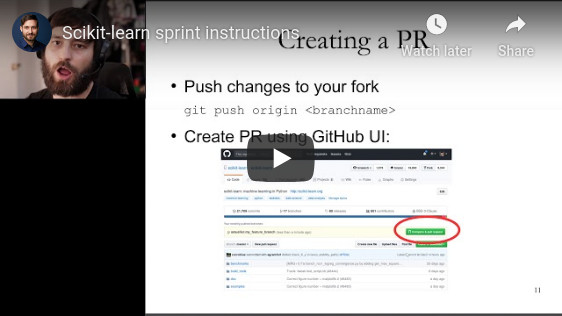

# EuroSciPy 2022 - Sprint - Basel
Repository with materials and instructions to setup your environment for the EuroSciPy sprint.

_2022, September 2_

## Before the Sprint (if you can)

Please try setting up your environment by following the first chapter of the
Workshop instructions (create a GitHub account and follow
[1.environment.md](1.environment.md)).

Feel free to familiarize yourself with git branching concepts by following the
[learngitbranching online tutorial](https://learngitbranching.js.org/) (no
installation required for this tutorial).

If you have the time, feel free to do as much as you want of the workshop on
your own. Feel free to ask question on our [Gitter Sprint Channel](https://gitter.im/scikit-learn/sprint).

## Workshop for first time contributors

- Create your [github account](https://github.com/join?ref_cta=Sign+up&ref_loc=header+logged+out&ref_page=%2F&source=header-home) 
if you don't have one already.
- **Set up your development environment** following the instructions in the markdown file of this repo:
  - [1.environment.md](1.environment.md)
  - [2.building.md](2.building.md)
- **Get familiar with the scikit-learn development process**
  - [3.example.md](3.example.md)
  - [4.test.md](4.test.md)
  - [5.workflow.md](5.workflow.md)
  - [6.ci.md](6.ci.md)
  - [7.documentation.md](7.documentation.md)
- Have a look a the resources linked below.
- Feel free too ask for help on our [Discord channel](https://discord.gg/D7k9Ez8u) or on the [Gitter Sprint Channel](https://gitter.im/scikit-learn/sprint), at any time.

If you already know how to build scikit-learn from source, run the tests of a
specific sub-module and use git to switch between branch and do pull requests,
feel free to start working on an issues (see below) instead.

## List of issues for the sprint

We will use this [sprint project board](https://github.com/orgs/scikit-learn-inria-fondation/projects/5) to
track pull requests during the afternoon (and after the sprint).

In particular those "meta-issues" list potential tasks to perform as first time contributors:

- https://github.com/scikit-learn/scikit-learn/issues/21350
- https://github.com/scikit-learn/scikit-learn/issues/23462
- https://github.com/scikit-learn/scikit-learn/issues/5435

Another one can interest people with a bit more experience:

- https://github.com/scikit-learn/scikit-learn/issues/11000

When referencing your PR and while linking it to an existing issue, please insert the following hashtag
#euroscipy22

## Additional Resources for beginners

#### [Scikit-learn contributor's documentation](https://scikit-learn.org/dev/developers/contributing.html)

#### [Craft Minimal Bug Reports](https://matthewrocklin.com/blog/work/2018/02/28/minimal-bug-reports)

#### Crash course in contributing to open source projects

by [Andreas Mueller](https://github.com/amueller)

#### Example of Submitting a Pull request to scikit-learn

by [Reshama Shaikh](https://github.com/reshamas/)

